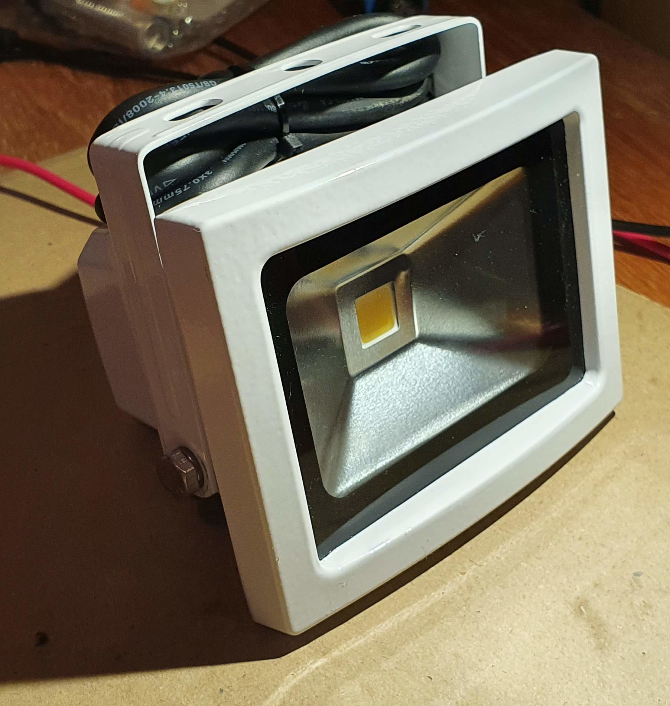
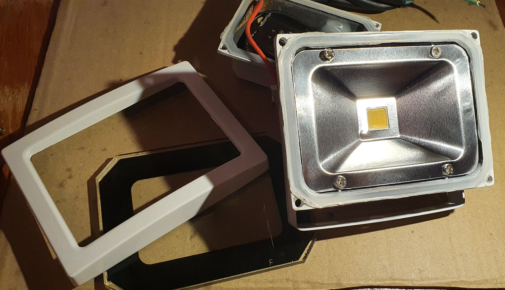
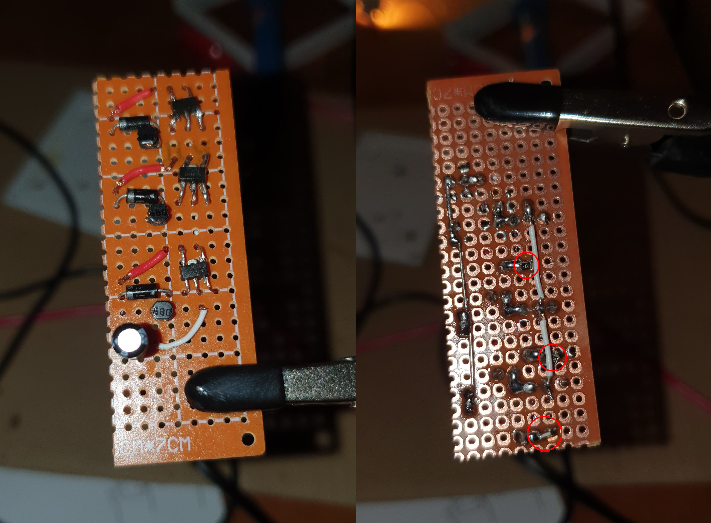
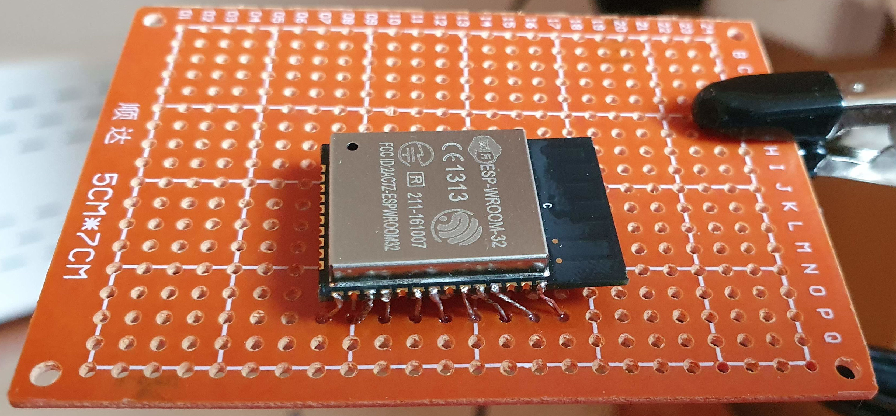

I was scouting Amazon and eBay for a controllable light to bring to parties, but I was left disappointed. The low end market is full of low power lights which are not bright enough and are controlled through a lousy remote controller. To get decent devices you need to go in the high end space where you can easily spend a few hundreds quids.

So I thought I should come up with my own solution.

I started by coming up with a list of requirements:
- Portable and battery powered
- Multicolor
- Powerful enough to light up a dark room
- Controllable with a smartphone app
- Programmable with custom effects

Given those requirements I started searching online for electric components that would fit the requirements.

Since the light would be battery powered, energy consumption is critical. The most efficient form of lighting is provided by LEDs. I wanted a multicolor light so it needed to be an RGB led. I settled on a 10 watts [Chip-on-Board (COB)](https://en.wikipedia.org/wiki/Chip_on_board) RGB LED.

For communication between the light and my smartphone I chose the [ESP32 microcontroller](https://duckduckgo.com/?q=espressif+esp32&iax=images&ia=images) which, for less than 5 quids, gives you: Wireless, Bluetooth, 32 KiB of RAM, and 34 programmable pins, [Pulse-width modulation (PWM)](https://en.wikipedia.org/wiki/Pulse-width_modulation) signals, and much more which is not relevant for this project.

For driving the LED, I was initially thinking of buying 3 separate LED driver modules, but they are quite expensive (compared to buying the individual components separately) unless you order them from China through Aliexpress or similar. However that would mean waiting for at least one month for delivery, so I decided to build my own LED driver from discrete components. Comparing the chips that existing LED driver are using and the availability of those chip I settled for using the [PT4115](https://duckduckgo.com/?t=ffab&q=PT4115+schematic&iax=images&ia=images).

Only when the chips arrived I realized that I had ordered them in the [Surface-mount technology (SMD)](https://en.wikipedia.org/wiki/Surface-mount_technology) package. Those are intended to be soldered on a custom [printed circuit board (PCB)](https://en.wikipedia.org/wiki/Printed_circuit_board). However for my prototype I intended to use a simple soldering protoboard, so I had to solder "legs" to all the SMD components in order to be able to plug them in the protoboard.

The circuit to run the PT4115 is quite simple and a reference design can be found in the official specifications along with the rules to pick the side components.

For Reference:
- **DIM** is the PWM control pin
- **CSN** is the control sensing pin which helps the chip detect the amount of current going in the LED
- **SW** is the switch pin which is turned on and off automatically to keep the right amount of current flowing through the LED.

Initially I thought to build my own case for the light, but after a quick search on eBay I found many variations of outdoor flood lights which I could simply modify for my purposes.

The light from eBay came with its own LED driver mounted on the back. It was quite bulky and unnecessary so it was the first thing I removed.

Then I proceeded to open the led compartment and finding out how much space I had to fit my own circuits. I was pleased to find out that the case was quite oversized and I had plenty of space to fit everything I needed.

The next step was to build the LED driver. I used a small piece of protoboard and duplicated 3 times the circuit that I have showed earlier for the PT4115. In the next photo I have highlighted the small SMD resistors for "Rs". It is not an elegant solution, but it works.

I had to do the same trick of adding "legs" to the ESP32 module as well in order to solder it. For powering it I chose to use a premade buck converter module, [the mini-360](https://duckduckgo.com/?q=mini+360+buck+regulator&iax=images&ia=images).

Then it was time to connect everything together and test the result. In the next video you can see that the the LED turns on only for a brief moment. That's because as soon as the ESP32 finishes booting its pins enter a low state, effectively turning off the LED drivers and the LED itself.



Having verified that the circuit works I proceeded fitting everything nicely in the light case. I used the black tape to set in place some transparent plastic in order to isolate the circuit from the metal case and avoid shorts. The dangling cables that you can see taped at the top of the next photo are used to flash the firmware on the microcontroller.

Next, it was time to write the firmware for the ESP32 so that it can control the individual colors and receive the commands from my smartphone. I read extensively the documentation for the ESP32 and found a couple of API for my use case: the [LED Control (LEDC) API](https://docs.espressif.com/projects/esp-idf/en/latest/esp32/api-reference/peripherals/ledc.html) which allows me to output PWM signals and the [NimBLE library](https://docs.espressif.com/projects/esp-idf/en/latest/esp32/api-reference/bluetooth/nimble/index.html) for Bluetooth Low Energy communication.

After spending a couple of days understanding the examples from the documentation I managed to put together my own firmware that exposes one Bluetooth LE characteristic that directly maps to the 3 RGB channels of the LED. The code is available on [GitHub](https://github.com/skilion/rgb-light-server).

The last remaining task was to build an Android App to connect to the ESP32 and send the light colors. I quickly hacked together a proof of concept that allows me to toggle the basic colors for testing, automatically switch between all colors randomly, flash the color at different speeds, smooth the color transition and control the light intensity (brightness). The code, again, is available on [GitHub](https://github.com/skilion/rgb-led-control-app).

And here you can see the final result.



Overall it has been a fun project that allowed me to play with electronics and learn a lot. The prototype hits all my requirements but the brightness is much less than I expected. I think a proper flood light should be at least 50W to make a good impression. I'll come back at this project and see if I can upsize the LED while still keeping everything battery powered.