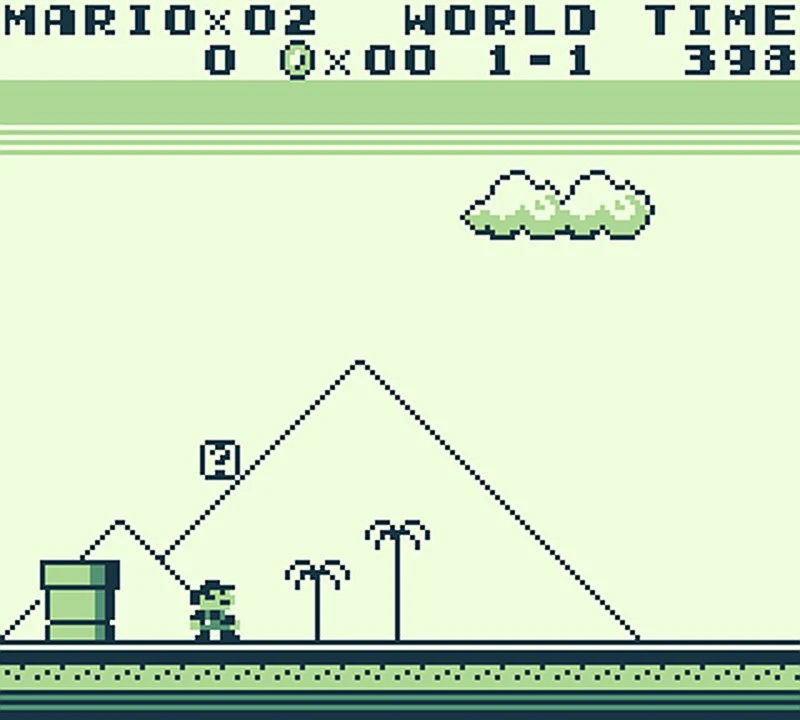

## Introduction

When I was a kid the first type of video games I played were [2D Side Scrollers](https://en.wikipedia.org/wiki/Side-scrolling_video_game).

I still remember the two most influential games on which influenced me the most: [Super Mario Land](https://en.wikipedia.org/wiki/Super_Mario_Land) and [Captain Claw](https://en.wikipedia.org/wiki/Claw_(video_game)).

Super Mario was the first game I ever played. I played it on a [Game Boy](https://en.wikipedia.org/wiki/Game_Boy) which my cousins lend to me because my parents were against buying game consoles ("You would waste all your time!", so true in hindsight).

Later, when the first computer arrived in my home, my first PC game arrived shortly after. I still remember how Captain Claw was so difficult for me and I never managed to beat the second level. At least until a friend of mine (who had access to internet!) discovered that [cheat codes](https://en.wikipedia.org/wiki/Cheating_in_video_games#Cheat_codes) existed.

"Jump And Run" is my tribute to those games and the endless hours I spent on them. I drew the art myself using [Gimp](https://www.gimp.org/), downloaded the music from the [Free Music Archive](https://freemusicarchive.org) and sounds from [Freesound](https://freesound.org/).

Here is a gameplay video of the beginning of the first level:



## Technology

The game runs on a custom 2D Game Engine which I wrote in C++. To draw I used [OpenGL](https://en.wikipedia.org/wiki/OpenGL) and for playing sounds I used [OpenAL](https://en.wikipedia.org/wiki/OpenAL).

Re-reading today the code today I see a lot of "code smells" like huge functions and bad names, however keep in mind that I just finished high school when I wrote it :).

I appreciate how neatly the generic parts of the engine are split in virtual classes that make sense. The skeleton of the engine with its initialization code is separate from the game logic. I remember this structure being deeply influenced by reading the code of famous game engines of the time such as Unreal Tournament and Quake 3 Arena.

I have forgotten how much time I spent rewriting much functionality of the standard library such as string and memory functions, file access, and various data structures. I was influenced by the fact that many game development articles recommended (and still do!) to avoid the standard library as it is not optimized for speed in most cases.

I was very proud of the built-in map editor which allowed me to build upon my basic drawing skill to design game maps that would become alive with sound, music, and animated enemies.



Another thing I remember fondly is the particle engine, which although its simplicity, it makes killing enemies very satisfying by releasing a swarm of blood particles which can collide with the game world.



The source code is available on [GitHub](https://github.com/skilion/jump-and-run) and it can be readily compiled on Windows and Linux. Pre-compiled binaries are also available.