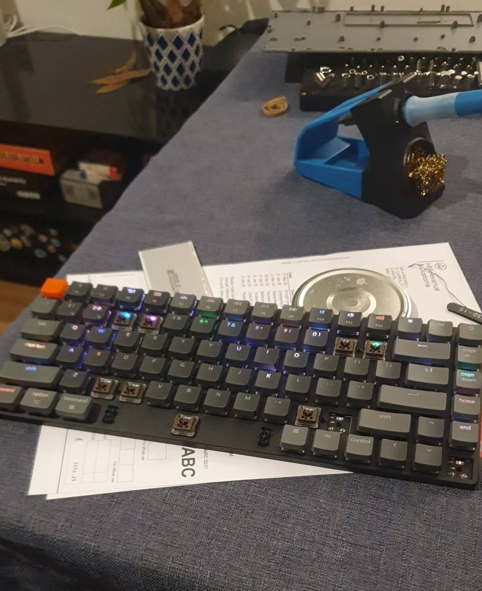
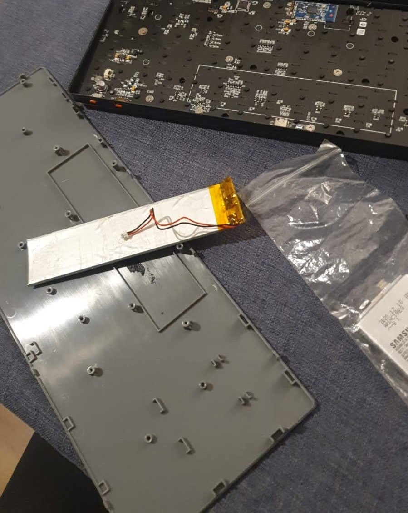

In the last year or so I became interested in 75% sized keyboards. I love this design because it strikes a good balance between compactness and functionality — as a programmer, I need my function keys!

For Christmas I finally decided to scratch my itch and bought a beautiful optical Keychron K3 off eBay. It's been a joy to type on, but with a big downside: the battery life is very bad.

With the backlight off, I struggled to get three days between charges. I didn't want to keep the keyboard to be constantly wired, so I thought I could replace the battery. I checked a few online reviews and found out new units are rated for about week of use, which isn't much of an improvement. I should have read about this _before_ impulse-buying the keyboard, but it was too late. 

I had a few used phone batteries collected over the years, so I thought I might be able to increase the total battery capacity by putting them to good use.

## The battery

The K3 is powered by a 3.7 V 1600 mAh lithium battery, and I was surprised to find out that it was almost twice as large and had less capacity than my old phone batteries, which are rated 3.85 V 3300 mAh. I did a deep-dive into lithium batteries and discovered that those batteries are dubbed "high-voltage". By using a slightly different chemistry than regular lithium polymer batteries, they tolerate a higher charging voltage (4.4 V vs 4.2 V) and can therefore squeeze a bit more capacity for our ever more power-hungry phones.

## The mod

Luckily, replacing a normal lithium battery with a high-voltage one is totally safe: it will be undercharged, but given the larger overall capacity the result is still a win. Assuming a 30% loss of the rated capacity because of the lower charging voltage, plus wear from previous use, I would still get about ~ 2300mA/h — not bad!

I figured I could fit two phone batteries in the frame by cutting a bit of plastic. Connecting two batteries in parallel effectively doubles the capacity. Before doing so, I carefully discharged the one that had the highest voltage until both were roughly the same within ±0.1 V — this to avoid any funny business when connecting them.

Soldering battery leads is almost impossible because the tabs are made of aluminum. I found  that a product called "aluminum flux" makes it very easy! It dissolves and prevents aluminum from forming its natural oxide layer.

## The Final Result

 

After this mod, I now get a good month of daily use from my Keychron, and I feel so satisfied that I've saved it from the bin and gave it a second life.