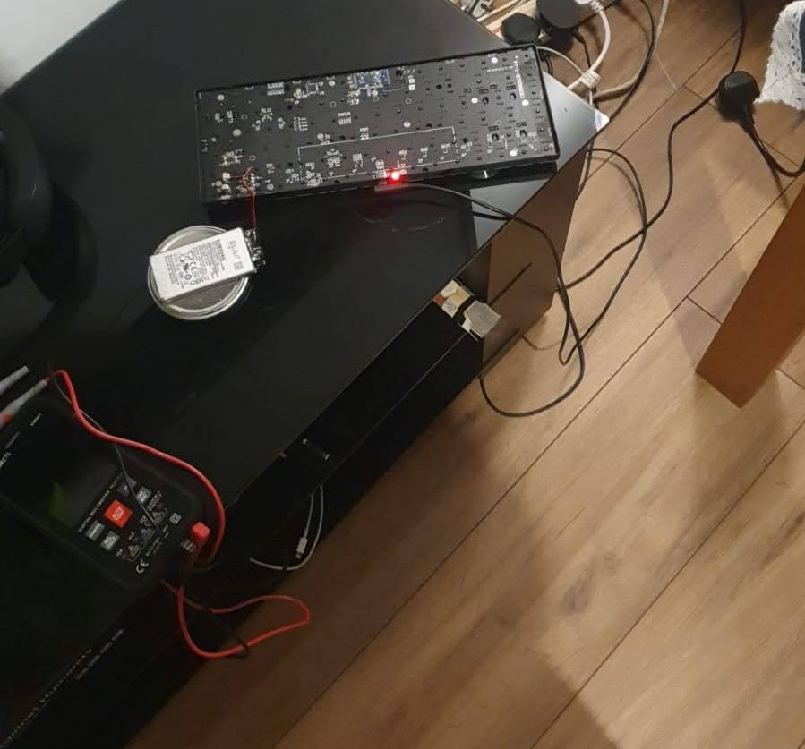

In the last year or so I became interested in 75% sized keyboards. I love this design that strikes a good balance between compactness and functionality — as a programmer I need my function keys!.

For Christmas, I finally decided to scratch my itch and buy a beautiful optical Keychron K3 off eBay. It's been a joy to type on, but with a big downside... the battery life is very bad.

With the backlight off, I struggle to get three days between charges. Online reviews for new units  (mine is used) usually advertise about a week of usage. Since I don't want my keyboard to be constantly wired, I decided to remove the dust from my solder and put my "collection" of old phone batteries to good use.

The keyboard is powered by a 3.7v 1600 mA/h lithium battery which is quite large compared to a phone battery. The phone batteries I had were much better specs at 4.4v 3300 mA/h, and even smaller, albeit a tad thicker.

I transferred the overvaltage protection circuit from the old to the new battery. Soldering on battery leads is quite difficult because they are made of Aluminum. However with the right product "Aluminum Flux" you can do it!

The difference in voltage is not a problem, it will mean that the battery won't be used to it's full potential because the charging circuit of the keyboard is designed to work with a 3.7v battery.

I then realized that if I cut a bit of plastic I could fit two batteries in the frame. Connecting two batteries in parallel effectively doubles the capacity. Before doing so, I carefully discharged the one that had the highest voltage until the two had roughly the same ±0.1 volt. This to ensure no funny business while doing the connections.

 

Now I get a good month of usage from my Keychron and feel so satisfied that I've given it a second life saving it from the bin.