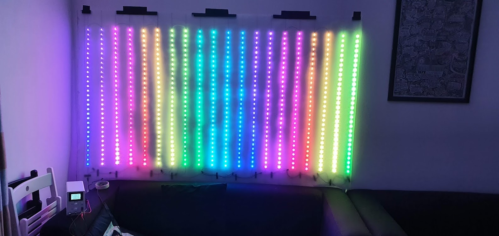

## Introduction

For New Year's Eve 2021, I decided to build a LED matrix that would react to the music being played.

I got inspired for this project by visiting the Cyberdog store in Camden Town. I wanted to recreate the same feeling I had when seeing for the first time the awesome [DJ booth](https://duckduckgo.com/?q=cyberdog+dj+booth&iax=images&ia=images) they have in the basement.

I started planning and building it one month before. However the project was too ambitious for my experience with electronics, I made a few mistakes and I had to cut the features short to meet the deadline.

I am very proud of the final result, I managed to implement the main effect I saw in Cyberdog and make it work just in time for new year. It was far from perfect but enough to create the right atmosphere:



## The Original Plan

My initial requirements were:
- build a LED matrix by cutting up a few meters of LED strips
- use an [ESP32 microcontroller](https://en.wikipedia.org/wiki/ESP32) to drive the strips
- have an app on my smartphone to create the animations in sync with music
- make the app and the ESP32 communicate via Bluetooth LE (partially reusing code from my [previous project](/blog/bluetooth-rgb-light))
- be as portable as possible
- budget of £100

The biggest cost would come from the LED strips so I checked EBay and decided to buy 20 meters of WS2812B Addressable RGB LED strips with a density of 30 LED/meter. With that I could create a `20x30` matrix and if I spaced each strip by `10cm` I could make it `2x1` meters big. Big enough for a strong impact.

The WS2812B LED strips work with `5V`. I estimated that 600 (`20x30`) LEDS would need a big `200W 5V` power supply and thick wires to sustain the amount of current needed (about `36A` assuming each LED consumes `0.06A` at maximum brightness). To avoid buying the power supply and the thick cables I decided to just use my bench power supply instead, with a higher voltage (`12V`+), and then connect a few [buck converters](https://en.wikipedia.org/wiki/Buck_converter) right before the LED strips to bring the voltage down to 5V.

The LED strips come with adhesive tape so I decided to stick them on a [frosted vinyl film](https://duckduckgo.com/?q=frosted+vinyl+film&iar=images&iax=images&ia=images) in order to be able to roll everything up when not in use. The frosted finish of the vinyl film helps hiding the cabling, leaving a cleaner look.

On the software side, I could build upon the code of my [previous project](/blog/bluetooth-rgb-light) and extend it to transmit an RGB matrix from my phone to the ESP32 which would in turn transmit it to the LED strip. In the app I could make some nice animations that would use the sound from the microphone as input.

With all this in mind, I orders the material, waited for delivery, and started building.


## Mistake 1: Bad Power Estimations

My biggest mistake was over estimating the power capacity of the buck converters.

I have experience with the super compact ["Mini 360" buck converter](https://duckduckgo.com/?q=mini+360+buck+converter) and I remembered from their spec that they could output up to `3A`.

I had read somewhere that a single WS2812B LED consumes a maximum of `0.06A`, so two strips of `1m` should consume a maximum of `2 * 30 * 0.06A = 3.6A`. I thought `0.06A` was probably an extreme case and that the real limit would be lower so I decided to connect each Mini 360 to 2 strips.

However, I overlooked the fact that `3A` was the **peak** output of the Mini 360, only sustainable for a short period of time. In my practical tests the Mini 360 becomes **dangerously hot** over `1.5A` and I realized that only when testing the LED matrix after all the soldering and cabling was done.

The deadline was close, un-soldering and re-soldering everything to add more Mini 360s would mean hours of work which I simply didn't had. In order to avoid missing the deadline I added some code to the ESP32 that would automatically limit the maximum brightness of the LEDs thus reducing the maximum current to a safe limit.

Lessons learned:
- double check the specifications of your components
- thoroughly test a subset of your project before soldering everything
- if you underestimate the power you may be able to scale down the usage your components and get away with it 😉

## Mistake 2: Mixing 5V and 3.3V Logic

The WS2812B LED strips are driven by `5V` data signals. The ESP32 uses `3.3V`, so common sense dictates that you need a [level shifter](https://en.wikipedia.org/wiki/Level_shifter) to interface the two. However this was not apparent to me because the LED strips work quite well *most of the time* even with a `3.3V` input.

This is because `3.3V` "high" signals are high enough to be recognized as "high" from `5V` components, *most of the time*. Glitches and flickers start appearing when refreshing the LED strips at high frequency:



However, I disregarded this problem as either some weak soldering or wrong voltage levels on my buck converters and went onward finishing building the LED matrix. Only at the very end, when I took the time to properly debug the issue I found the actual cause of the flickering.

Since I did not want to wait for the delivery of a level shifter I started tinkering with the voltage levels of the buck converters and discovered that if I lowered the voltage of the buck converter that powered the first line of LEDs where the ESP32 was connected to, all the flickering would disappear.

This makes sense since I am actually making the LEDs work in a voltage range closer to the ESP32. This 'hack' works but it left my first two strips emitting a slightly different color than the rest. Luckily it is hardly noticeable when playing fast animations.

Lessons learned:
- `3.3V` and `5V` circuits require a level shifter to interface them
- lowering the supply voltage of the `5V` circuit (in this case) is enough to get away with it 😉

## Mistake 3: Assuming Real-Time Programming Is Easy

Another mistake I made was to underestimate the complexity of building the software to drive the LED matrix.

I assumed that extending the code I already had from my [previous project](/blog/bluetooth-rgb-light) would not take much and left it for the last week before New Year. I did the change fairly quickly but then I hit a serious problem.

The communication between my phone and the ESP32 is done using [Bluetooth Low Energy](https://en.wikipedia.org/wiki/Bluetooth_Low_Energy). The ESP32 supports Bluetooth 4.2 which, configured with a large Maximum Transmission Unit (MTU) and the Data Length Extension Enabled (DLE), should about `478 KBit/s` as measured in [this article](https://www.novelbits.io/bluetooth-5-speed-maximum-throughput/) (see Case 3).

For my use case I would need to transmit the color for 600 pixel at least 30 times per second.

```
600 * 3B (number of RGB colors) = 1800B
1800B * 30 = 54000B = 54KB
54KB * 8 = 432KBit
```

`432KBit` are about 10% lower than `478KBit`, so, when planning, thought I would not have any problem.

However, reality is not that straightforward. The Bluetooth API are not really made for maximum throughput out of the box and optimizing both an Android app and the ESP32 requires reading lots of documentation and lots of trial and error. In the end, I did not have enough time to properly do it.

My initial tests showed miserable performance in the range of 1 to 5 frame per second, with noticeable change in speed from time to time. That was unacceptable to show animations that react in real-time with the music.

Animations that slow are very hard to watch so I decided to create the animations directly on the ESP32 instead of my phone. That is not ideal because it is much faster to develop and release for a smartphone than a microcontroller.

With the time left I chose one animation, the histogram of the audio frequencies, and hardcoded it in the ESP32. My phone would then only calculate the height of the histogram bars and send it. Since the histogram itself is very little I could get away with my limited bandwidth.

I had to make the histogram on the phone because it was the only device with a microphone. The ESP32 by itself cannot listen to sounds.

For curiosity, the histogram is calculated using the [Fast Fourier transform](https://en.wikipedia.org/wiki/Fast_Fourier_transform).

Lessons learned:
- real-time task are a long process of optimization, plan accordingly
- if you can't meet the deadline, cut the features and you may get away with it 😉

## Mistake 4: Dangling Power Cables

I guess this is one of the things one has to learn the hard way.

Much like in software development you never do tests in Production, in hardware you do not leave your "delicate" components close to "dangerous" equipment like a power supply.

When testing the LED matrix I had my power supply at `12V` connected directly with [alligator clips](https://duckduckgo.com/?q=allicator+clips&iax=images&ia=images). My ESP32 was also nearby supplying the data to the LED strips. Accidentally, the data line from the ESP32 entered in contact with the alligator clips of the power supply, immediately destroying my ESP32 development board and a few meters of LED strips.

Luckily this happened quite early so I could wait for the delivery of a replacement ESP32 and new LED strips. I now make sure to always isolate my dangling cables with some [masking tape](https://duckduckgo.com/?q=masking+tape&iax=images&ia=images).

Lessons learned:
- isolate parts of your projects that operate at different voltage

## Final Result

Here is a video that shows the internal cabling of the LED matrix. Before hanging it on the wall I simply folded the rest of the vinyl film to cover the circuit.





## Conclusion

When I turned the LED matrix on at New Year my friends were ecstatic. It made all the hours spent soldering and testing worth it.

I have learned a lot from this project. It is something I had never attempted at this scale and I am now working on improving it to match my original plan. Stay tuned.

---

[Comments](https://news.ycombinator.com/item?id=30140641)
