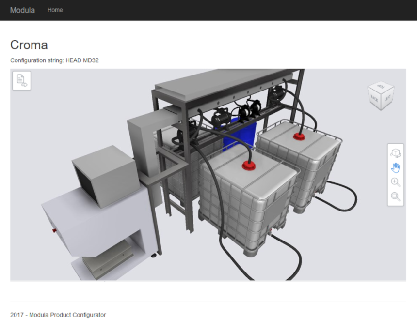
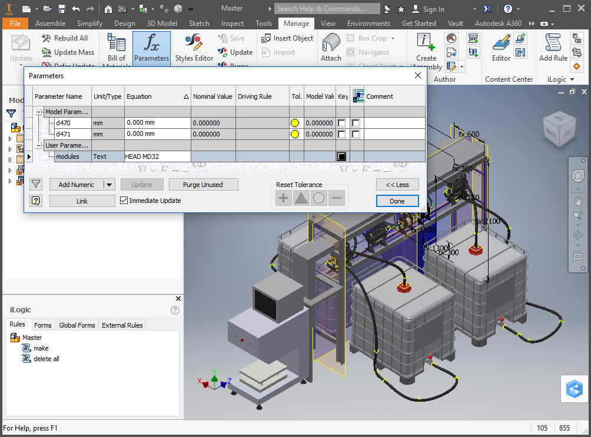

## Intro

In parallel to my master studies I enrolled in an honor program called [Alta Scuola Politecnica](https://www.asp-poli.it/). The greatest thing about this program has been the graduation project which consisted in a collaboration with a real business.

I joined a team of brilliant colleagues, from different backgrounds in management engineering, mechanical engineering and physics. Together we acted as a consulting team for a business, understood their problem, performed a research about the state of the art and delivered a solution.

## Background

The project I joined was sponsored by [Inkmaker Srl](https://www.inkmaker.com/).

Inkmaker is a global producer of ink dispensing machines. These machines mix ink to produce the exact color required for printing or painting products at industrial scale.

The ink dispensers are large and quite specialized machines. Clients may have strict constraints concerning the available plant area or uncommon requirements on the ink mixing capabilities. Therefore the development of each machine tends to be quite customized for each client.

However Inkmaker also have a portfolio of entry-level machines that address the demand of their smaller customer with just a few variations. The vision of Inkmaker was to enable their small customers to self design their equipment by providing a set of standard modules to be mixed and matched. Those modules could be combined producing different assembly combinations and layouts to satisfy most request with minimal involvement from Inkmaker, thus increasing the overall efficiency.

The solution identified by Inkmaker to realize this vision consisted in the development of a [product configurator](https://en.wikipedia.org/wiki/Configurator) that would allow clients to design their own machines with a few clicks, resulting in reduced [lead time](https://en.wikipedia.org/wiki/Lead_time) and errors in order interpretations.

## My Contribution

My work was based on the results of my dear colleagues who took care of:
- Analyzing the business processes of Inkmaker (sales, design, purchase).
- Understanding the mechanical constraints of the product and define how to modularize it.
- Developing a model for generating a machine starting from the client requirements using the available modules.

I applied my skills in two areas:
1. Performing a research of the [state of the art](https://en.wikipedia.org/wiki/State_of_the_art) of existing product configurators.
2. Implementing a prototype product configurator to showcase to Inkmaker.

### State of the Art

My first task consisted in researching existing product configurators  to identify the best ones suited for the requirements of Inkmaker.

 I researched both:
- Software available "off the shelf" that could be used to customize a generic product.
- Established product configurators from major retailers to study their offering and capabilities.

I wrote a report that summarized the pros and cons of each product, their features, their user interface (UI) and their configuration process.

The outcome of the research lead to the discovery of a few products that were fit for Inkmaker use-cases. Here is a feature matrix comparing the products against our requirements:

The best candidate "A" was *Autodesk Configurator 360* (now discontinued).

### Prototype

My second task consisted in learning the inner workings of Configurator 360, understanding how to integrate it in a customized experience for Inkmaker, and developing a prototype.

Configurator 360 was a cloud based [software as a service](https://en.wikipedia.org/wiki/Software_as_a_service) (SaaS). CAD designs could be uploaded to it and then displayed through an interactive [web widget](https://en.wikipedia.org/wiki/Web_widget).

I decided to build a web application that would first guide the customer through the configuration process, then calculate the best configuration for the ink dispenser, and finally provide the result to Configurator 360 which would then generate the engineering drawings, 3D visualizations, and bill of materials.

The web application was built in C# ASP.NET with Javascript and JQuery for frontend. It was deployed on Amazon EC2 to provide a demo to show to Inkmaker. Customer details would be saved in a SQL database for reference and potentially integrate with the company ERP.

## Credits

I want to credit the rest of the [Modula](https://www.asp-poli.it/projects/modula-web-configurator-for-automatic-dispensing-system/) team from which I learned a lot and together we delivered this fantastic project.

- Alex Saja ([Linkedin](https://www.linkedin.com/in/alexsaja/))
- Alfredo Fantetti ([Linkedin](https://www.linkedin.com/in/alfredo-fantetti-4722bbb7/))
- Arianna Rosa Brusin ([Linkedin](https://www.linkedin.com/in/arianna-rosa-brusin/))
- Giovanni Prencipe ([Linkedin](https://www.linkedin.com/in/giovanni-prencipe-926a7311b/))
- Sara Mottola ([Linkedin](https://www.linkedin.com/in/saramottola/))
- Stefano Amato ([Linkedin](https://www.linkedin.com/in/stefanoamato93/))
