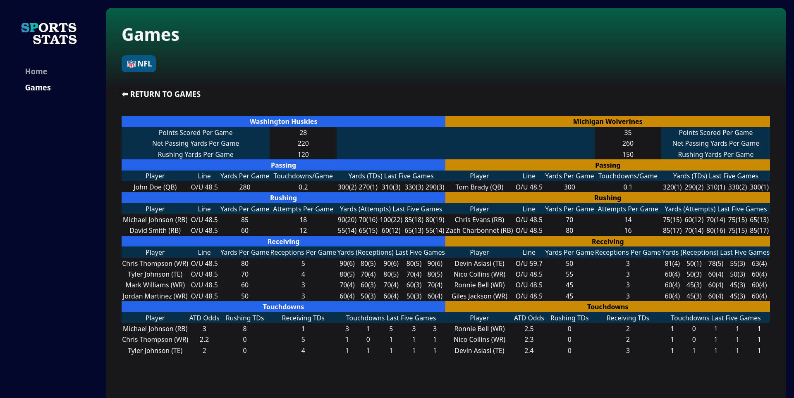

I recently took a "homework project" for a job interview. What began as a daunting task turned into a pleasurable learning experience of [React](https://react.dev/) and [Next.js](https://nextjs.org/) and I got a new tiny project to showcase here.

## Homework Projects
For those who don't know, job interviews usually begin with a coding interview which consists of about an hour of solving coding problems under a time constraint. Some people criticize these evaluation methods  as not being very representative of what the day-to-day work of a software engineering looks like.

Alternatives to coding interviews are "homework projects". These projects consists of somewhat vague requirements that needs to be translated into a working program. They aim to test your ability to make reasonable guesses at the missing requirements and build something decent from them. In my experience this approach better reflects what a typical day as a software engineer will look like. Compared to the "classic" coding interview, homework projects remove the stress of being questioned and evaluated under tight time constraints. However, they require you to dedicate a few hours (or even days) of your valuable time, with no guarantee of a getting anything back in return.

## The Challenge
My homework was to build a fullstack web application to visualize some [NFL](https://www.nfl.com/) statistics. The assignment also required using React and Node.js in the tech stack. I had no prior experience with React, but I was confident the learning curve wouldn't be too steep since I already know [Angular](https://angular.io/) (a similar library). I had the time to dedicate myself fully to the homework, so I decided to take advantage of that and use the opportunity to learn React.

## The Tech Stack
Since the landscape of JavaScript web development is constantly evolving, I started with researching the current "state of the art" and finally decided on Next.js and [Typescript](https://www.typescriptlang.org/). For styling the frontend I settled on [Tailwind CSS](https://tailwindcss.com/). TypeScript should come at no surprise as it is the de-facto standard for JavaScript development today. Thanks to its static typing, TypeScript allows the IDE to provide useful suggestion when coding and detect many errors at compile time.

Next.js is a web framework based on React that offers [server-side rendering](https://en.wikipedia.org/wiki/Server-side_scripting) in addition to client-side. What truly impressed me about Next.js was its cohesive set of functionalities that cover both backend and frontend development out of the box and the [App Router](https://nextjs.org/docs/app). The App router makes it easy to to create dynamic APIs and routes by using the files and directories with specific names. This approach not only saves time but also improves the project's overall structure.

Tailwind is a CSS framework that provides a low-level set of utility classes that wraps basic CSS directives. Unlike other frameworks (ex. [Bootstrap](https://getbootstrap.com/)) it doesn't try to provide classes for predefined elements like cards or modals. I was skeptical about it because it seemed an unnecessary layer on top of CSS but I decided to give it a go given its popularity.

## Embracing the Learning Process
I find that I learn best when I am trying to build something. I started out by skimming through the official tutorials of React and then Next.js. Once I got the feeling on how to use the two I launched myself straight into the homework. At every step I would ask myself how to proceed, make a guess, and then check online the recommended way of solving it. This process starts slow, with me constantly searching and copy-pasting, but soon I start to internalize enough concepts to get going on my own.

## Tailwind CSS

This project made me reconsider my skepticism against Tailwind. Sure, it is simply wrapping CSS in simple classes, but by doing so it reduces its verbosity making it more concise, it standardizes the use of sizes, and finally it forces all styling to be tightly coupled to your components. So really, instead of writing CSS classes for your components you are writing the components themselves directly, saving one step. Furthermore by not having additional CSS classes you do not have to manage ever growing CSS files in your projects. When you need to make modifications you only change the components that are affected.

## E2E Testing

As I neared completion of the project, I decided to take it a step further by incorporating end-to-end (E2E) testing using [Playwright](https://playwright.dev/). Playwright is a modern testing framework that allows you to automate browser interactions and simulate user behavior across different scenarios. The ease of writing and executing E2E tests with Playwright is astounding and makes me happy again about web development in 2024.

## Conclusion: A Week of Growth and Achievement

As a developer I find that the best way to learn is by building something, and thanks to the interview project I now feel proficient in React, Next.js and Tailwind CSS. 

As I submitted the homework project and prepared for the interview, I reflected on the rapid growth and newfound confidence gained through this accelerated learning experience. Whether you're a seasoned developer or a beginner, embarking on intensive learning journeys like this not only sharpens your skills but also fuels your passion for innovation in the ever-evolving tech industry.

## Live Demo

The live demo is hosted at: https://sports-stats-demo.vercel.app

Source code: https://github.com/skilion/sports-stats
