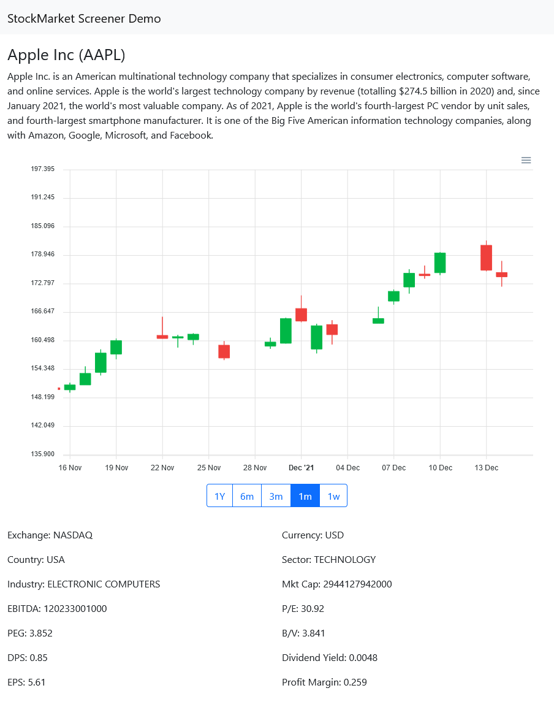

In the last couple of years I have been actively investing my savings in the Stock Market. I have learned a lot on how finance works but long story short, I am not interested in investing in the stock market anymore since I came to realize that:

1. I don't own enough capital to make substantial returns
2. Beating the market average is difficult (it requires a *lot* of time)

Therefore I'm better off by focusing on my job and investing in **myself** rather than than the stock market. At least for the next 5 years or so.

My surplus money can track the market average and I stay clear from crypto, on which I am not willing to risk any substantial amount of money, but that's for another post.

Anyway, before my crush on the stock market faded-and feeding off my engineering spirit-I was fascinated by the idea of developing my own [trading bots](https://en.wikipedia.org/wiki/Automated_trading_system).

Developing trading strategies needs at minimum:
1. A strategy (duh!)
2. Market data to backtest the strategy

I decided to focus on market data first, and I quickly realized that is no real good free source of it, unless you want to pay $$$. Then I found out about [Alpha Vantage](https://www.alphavantage.co/) which is a market data provider with a generous free tier which gives unlimited access to global market data, but it comes with a strong rate limit on the speed at which you can read it.

So I went to work and developed a few Python scripts that would slowly crawl  Alpha Vantage each day and collect price and company information in a database from which I could easily run query or make simulations via [Jupiter Notebooks](https://jupyter.org/).

I managed to get a working crawler but then quickly lost my interest in developing strategies. Instead of throwing away my work I decided to turn it in a basic stock market screener to add to my portfolio by adding a web interface on top.

The project is mainly composed of 3 components: the Data Ingestion service, the Database, and the Stock Screener web app. They are all hosted on [Microsoft Azure](https://azure.microsoft.com/en-gb/).

The arrows in the diagram represent the flow of market data.

The Data Ingestion service is the crawler that I mentioned earlier. It is written in Python and uses [httpx](https://www.python-httpx.org/) to download data from Alpha Vantage and [pyodbc](https://github.com/mkleehammer/pyodbc/wiki) to talk with the database. I spent some time learning how to use async programming with Python to be able to parallelize the HTTP requests to Alpha Vantage, but then I hit the bottleneck of pyodbc which does not have async support at the moment.

The Database is a classic relational SQL database which is good enough for my use case, without having to disturb the folks in the NoSQL world.

The Web App is built with [ASP.NET Core](https://dotnet.microsoft.com/en-us/apps/aspnet). The frontend uses Bootstrap 5, [htmx](https://htmx.org/) and [Alpine.js](https://alpinejs.dev/).

This is the first time I have worked with ASP.NET. Overall it was a good experience, ASP.NET is a mature technology with plenty of documentation. I developed the web app entirely within Visual Studio 2022 to see what Microsoft is up these days and I found it very simple to use and quite snappy. I was surprised to find out that Visual Studio Code with the C# Extension is capable to replace Visual Studio entirely, debugging capabilities included! I could do the development entirely on Linux or Mac seamlessly.

The code is hosted on [GitHub](https://github.com/skilion/stock-screener). A running demo can be accessed at http://stock-screener-web-app.azurewebsites.net at least until the billing starts to be higher than a few quids a month.
