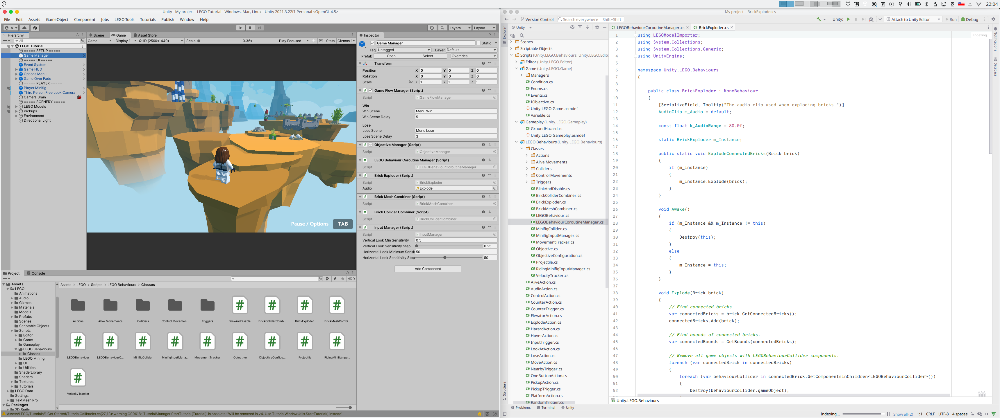

I have been dabbling with [Unity](https://unity.com/) lately. Linux is my main OS and I have encountered a few headaches  setting up my development environment.

To be able to write scripts in Unity you need to use an [external code editor](https://docs.unity3d.com/Manual/ScriptingSettingUp.html). Of course if you don't care about auto-completion and debugging you can use any editor, but that's not a realistic use case.

The officially supported IDEs are:
- Visual Studio
- Visual Studio Code
- JetBrains Rider

# Visual Studio

If you are on Windows the no-brainier solution is Visual Studio. However on Linux it is not available.

# Visual Studio Code

My first choice was VS Code since it is free to use. However, at the time of writing (Q1 2023), it is hard to setup and can't be used for debugging.

To use VS Code you need to install the C# extension and a supported C# compiler to enable auto-completion. The current LTS version of Unity (LTS 2021) uses .NET Standard 2.0 and generates `.csproj` files targeting .NET Framework `4.7.1`. That means you cannot use the official Microsoft .NET 5+ compiler for Linux because it doesn't support `4.7.1`. In theory you could manually rewrite the `.csproj` files, because .NET 5 is compatible with .NET Standard, but Unity will overwrite your `.csproj` files without notice. That leaves you with the only option of installing the old [Mono .NET Framework](https://www.mono-project.com/) which, unfortunately, is a dying project. I am using Debian 11 and there is no repository from Mono to install the latest version although Debian 11 has been around since August 2021... Fortunately the version of Mono for Debian 10 still works (note that you need to [pin the repository](https://wiki.debian.org/AptConfiguration) in APT or else APT will install an older version of Mono from the Debian "stable" repository).

Even if you get auto-completion to work, you will have to use the UNofficial [Debugger for Unity](https://marketplace.visualstudio.com/items?itemName=Unity.unity-debug) extension which I had no luck running at all. It would have been nice to find out before I spent hours installing Mono...

At this point we are left with only one option.

# JetBrains Rider 

Rider is not free at all, but if you are a student you can get the Educational version for free.

I tried to install Rider both manually (extracting the `.tar.gz` to `/opt`) and through [Flatpak](https://flathub.org/apps/details/com.jetbrains.Rider). However both attempts did not get recognized by Unity so I could not get Unity to launch Rider correctly from inside the game editor.

The only way that worked was by installing Rider with the [JetBrains Toolbox App](https://www.jetbrains.com/toolbox-app/). Afterwards, Rider just worked. Both auto-completion and debugging. And I did not even need to install Mono! The official .NET distribution from Microsoft worked just fine.

Finally I got a working Unity development environment!
